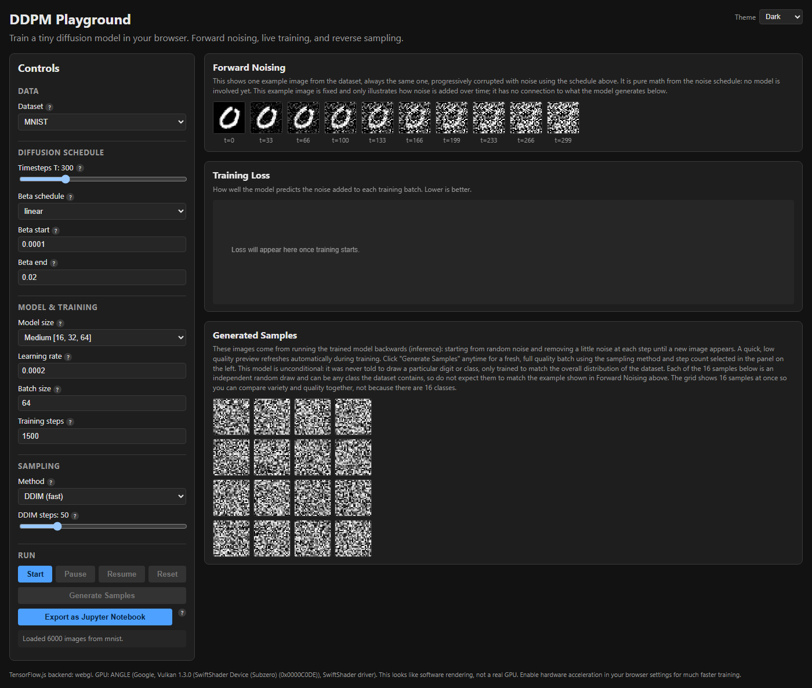

# DDPM Playground

A hands-on, in-browser playground for teaching Denoising Diffusion Probabilistic Models (DDPM), built with [TensorFlow.js](https://www.tensorflow.org/js). Train a small diffusion model entirely client-side, tweak the noise schedule and model hyperparameters, and watch both the forward noising process and reverse sampling (DDPM/DDIM) happen live in the browser.

**Live demo: https://mzelbash.github.io/ddpm-playground/**



## What it does

- Trains a tiny U-Net noise-prediction model on MNIST or Fashion-MNIST, entirely in the browser (no backend, no GPU server required).
- Visualizes the forward noising process (a training image progressively corrupted per the noise schedule) and live training loss.
- Generates new images by running the trained model in reverse, with a choice of DDPM (full ancestral) or DDIM (fast) sampling.
- Exports the current settings as a runnable Jupyter notebook (PyTorch), so the same setup can be trained with a real GPU in Colab or a local Jupyter install.

## Getting started locally

Most people can just use the live demo above. Run it locally instead if you want to modify the code, or use it offline.

**Prerequisites:** [Node.js](https://nodejs.org/) 18 or later (includes `npm`).

```bash
git clone https://github.com/mzelbash/ddpm-playground.git
cd ddpm-playground
npm install
npm run dev
```

`npm run dev` starts a local dev server (Vite) and prints a URL, typically `http://localhost:5173/`. Open that in your browser. The dataset sprite sheets under `public/data/` are already included in the repo, so no extra download step is needed to start training right away.

To stop the server, press `Ctrl+C` in the terminal where it's running.

### Regenerating dataset assets

The MNIST / Fashion-MNIST sprite sheets under `public/data/` are pre-built and already checked into this repo, so you normally don't need to touch this. If you want to rebuild them (e.g. with a different image count), run:

```bash
node scripts/prepare-dataset.mjs --dataset=mnist --count=6000
node scripts/prepare-dataset.mjs --dataset=fashion-mnist --count=6000
```

## Deployment

This section is only relevant if you have push access to this repo (e.g. you're maintaining your own fork). It doesn't affect using the live demo or running locally.

Every push to the `main` branch automatically rebuilds the app and redeploys it to GitHub Pages, via the workflow defined in `.github/workflows/deploy.yml`. No manual build/deploy step is needed. If you fork this repo and want your own live copy, you'll need to enable Pages once under **Settings &rarr; Pages &rarr; Build and deployment &rarr; Source: GitHub Actions**.
