# DDPM vs. DDIM: same trained model, two different ways to reverse it

Both samplers in the [DDPM Playground](https://mzelbash.github.io/ddpm-playground/) reuse the identical noise-prediction network. Nothing about training changes. The entire difference is in the math used to walk backward from noise to image: DDPM takes small, stochastic, single steps; DDIM takes a direct, often deterministic jump between any two timesteps.

Trained on MNIST, 343,617 parameters, 3,000 training steps, final loss 0.0852, same starting noise used throughout every comparison below.

## 1. What both methods share: the forward process and epsilon-theta

Training is identical for both samplers. A real image `x_0` is mixed with Gaussian noise according to a fixed schedule, and a network `epsilon_theta` is trained to predict exactly which noise was added, at any timestep `t`:

$$x_t = \sqrt{\bar\alpha_t}\, x_0 + \sqrt{1-\bar\alpha_t}\, \epsilon, \qquad \epsilon \sim \mathcal{N}(0, I)$$

This is the only equation DDPM and DDIM agree on using directly. Everything below is about how each one runs that trained network backward, after training is already done.

## 2. The move that makes DDIM possible: predicting x-hat-0

At any timestep, once the network has made its prediction, the forward equation can be solved algebraically for `x_0`, a one-shot estimate of what the network currently believes the clean image looks like, however rough that guess is while `t` is still large:

$$\hat{x}_0 = \dfrac{x_t - \sqrt{1-\bar\alpha_t}\,\epsilon_\theta(x_t, t)}{\sqrt{\bar\alpha_t}}$$

DDPM's derivation never uses this quantity explicitly. DDIM's derivation is built entirely around it, which is exactly what unlocks skipping steps (section 4 below).

## 3. The reverse update, side by side

### DDPM: full ancestral sampling (Ho et al., 2020, Algorithm 2)

$$x_{t-1} = \dfrac{1}{\sqrt{\alpha_t}}\left(x_t - \dfrac{\beta_t}{\sqrt{1-\bar\alpha_t}}\,\epsilon_\theta(x_t,t)\right) + \sigma_t z$$

$$\sigma_t^2 = \tilde\beta_t = \beta_t\,\dfrac{1-\bar\alpha_{t-1}}{1-\bar\alpha_t}, \qquad z \sim \mathcal{N}(0, I) \text{ every step}$$

- Derived from the true posterior of the forward Markov chain: valid only for adjacent steps, `t -> t-1`.
- Injects fresh Gaussian noise `z` every single step: always stochastic.
- Needs all `T` steps, in order. No legal way to skip one.

`sampleDDPM` in [`src/diffusion/sample.js`](../src/diffusion/sample.js) (simplified; the real code wraps this in `tf.tidy` and explicit tensor disposal):

```js
for (let t = T - 1; t >= 0; t--) {
  const epsPred = model.apply([x, timeEmbed(t)]);
  const mean = x
    .sub(epsPred.mul(beta / sqrtOneMinusAlphaBar))
    .mul(1 / sqrtAlpha);
  if (t > 0) {
    const z = tf.randomNormal(x.shape); // fresh
    x = mean.add(z.mul(sqrtPostVar));   // step
  } else {
    x = mean;
  }
}
```

### DDIM: deterministic by default (Song et al., 2021, non-Markovian generalization)

$$x_{t-1} = \sqrt{\bar\alpha_{t-1}}\,\hat{x}_0 + \sqrt{1-\bar\alpha_{t-1}-\sigma_t^2}\,\epsilon_\theta(x_t,t) + \sigma_t z$$

$$\sigma_t = \eta\sqrt{\dfrac{1-\bar\alpha_{t-1}}{1-\bar\alpha_t}}\sqrt{1-\dfrac{\bar\alpha_t}{\bar\alpha_{t-1}}}$$

$$\eta = 0 \;\Rightarrow\; \sigma_t = 0 \;\Rightarrow\; x_{t-1} = \sqrt{\bar\alpha_{t-1}}\,\hat{x}_0 + \sqrt{1-\bar\alpha_{t-1}}\,\epsilon_\theta(x_t,t)$$

- Derived to hold for *any* earlier timestep, not just `t-1`: `t -> t_prev`, any earlier timestep, not just `t-1`.
- `eta` is a dial: `eta=0` removes noise entirely, so the same seed always gives the same image.
- Because any jump is valid, sampling only needs a short strided subsequence of timesteps.

`sampleDDIM` in [`src/diffusion/sample.js`](../src/diffusion/sample.js) (simplified; the real code wraps this in `tf.tidy` and explicit tensor disposal):

```js
const x0Pred = x
  .sub(epsPred.mul(sqrtOneMinusAlphaBar))
  .div(sqrtAlphaBar)
  .clipByValue(-1, 1);          // predict clean image

x = x0Pred.mul(sqrtAlphaBarPrev)
  .add(epsPred.mul(dirCoef));   // jump straight to t_prev
// eta is 0 by default: no random z term added
```

## 4. Why DDPM can't just skip steps the same way

DDPM's update formula comes from the true posterior `q(x_{t-1}|x_t,x_0)` of the specific Markov chain used during training, a distribution that is only defined between adjacent timesteps. There is no closed form inside that derivation for jumping from `x_t` straight to, say, `x_{t-30}`; the intermediate noise contributions simply don't cancel out algebraically that way.

DDIM's contribution was showing that a whole family of *non-Markovian* forward processes shares the exact same marginal `q(x_t|x_0)` that DDPM was trained under. Same marginal means the exact same trained network stays valid, nothing is retrained, while the reverse process this new family admits has a direct, closed-form jump between any two timesteps. That's the entire trick.

## 5. Determinism, demonstrated on this exact model

Same trained weights, same starting noise `x_T`, each sampler run twice.

| Sampler | Max pixel difference between the two runs | What that means |
|---|---|---|
| DDIM (eta=0) | 0.00e+00 | Effectively zero: bit-for-bit reproducible. |
| DDPM | 6.4401 | Different every time: a fresh random draw is injected at every one of the 300 steps. |

## 6. Real results from this model

Trained with the playground's own defaults: MNIST, medium U-Net, linear schedule, T=300.

| Training steps | Final loss | Training time | Parameters |
|---|---|---|---|
| 3,000 | 0.0852 | 14.5 min | 343,617 |

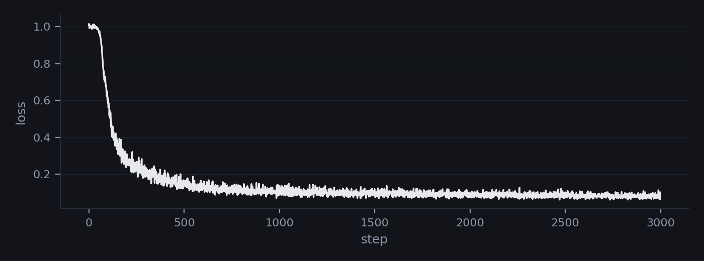

Both samplers below start from the *same* random noise tensor.

**DDPM &middot; 300 steps &middot; 5.4s**


**DDIM &middot; 50 steps &middot; 1.2s**

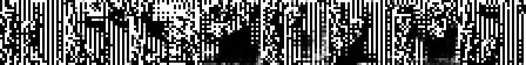

DDIM used 6.0x fewer network calls and finished 4.4x faster than full DDPM ancestral sampling, from the same starting noise. But at *this* training budget (3,000 steps, loss 0.0852), that speed has a real cost: DDPM's samples show recognizable stroke-like structure, while DDIM's 50-step samples are visibly broken, closer to corrupted noise than to a digit. This is the same checkpoint, the same trained network, the same starting noise, and the only difference is which reverse-sampling math ran it.

**It's a concrete answer to a question that comes up constantly when training loss looks fine but the playground's default DDIM output still looks bad: try switching Sampling Method to DDPM, or raise DDIM steps.** Under-training expresses itself differently depending on how much of the reverse trajectory the sampler is allowed to walk.

### Denoising trajectory

The denoising trajectory itself looks different too: DDPM's is a long, gradual walk; DDIM's is the same journey compressed into far fewer, larger jumps.

**DDPM trajectory** (t = 300, 225, 150, 75, 30, 0):

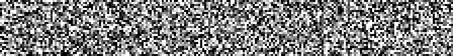 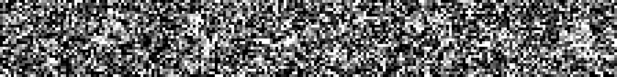 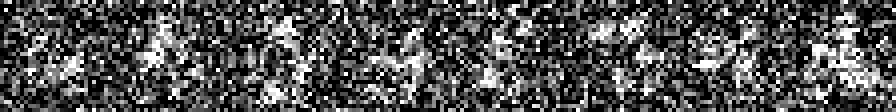 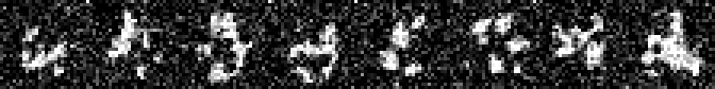 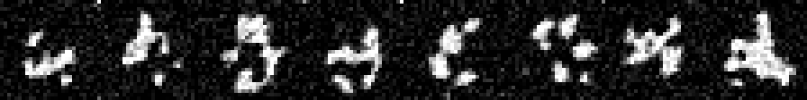 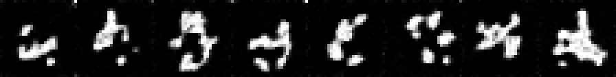

**DDIM trajectory** (t = 294, 222, 150, 72, 30, 0):

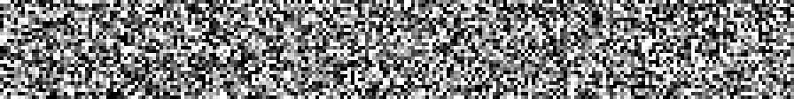 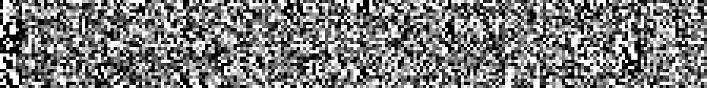 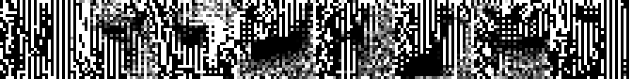 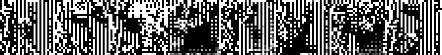 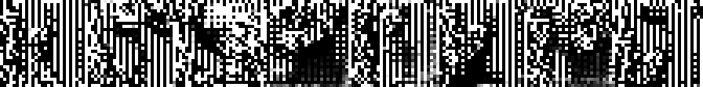 

## 7. Summary

| | DDPM | DDIM (eta=0) |
|---|---|---|
| Forward process assumption | Markov chain | Non-Markovian family, same marginals |
| Valid reverse jump | t -> t-1 only | t -> any earlier t |
| Stochasticity | Always (fresh noise every step) | Deterministic at eta=0, tunable via eta |
| Steps needed here | 300 | 50 |
| Retraining to switch methods | Not needed | Not needed, same trained network |

---

Generated from the model trained in this repo. Formulas and code excerpts correspond exactly to [`src/diffusion/sample.js`](../src/diffusion/sample.js). An interactive version of this reference (with inline color-coded equations) is linked from the [README](../README.md).
